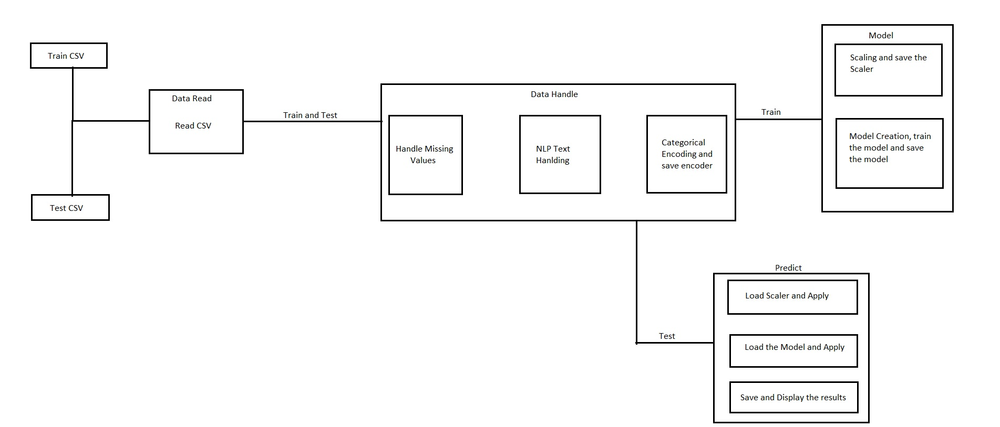
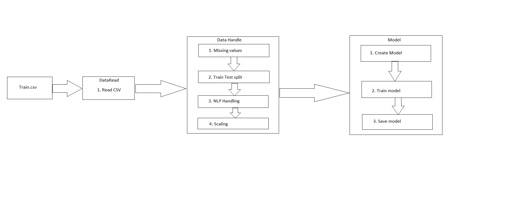
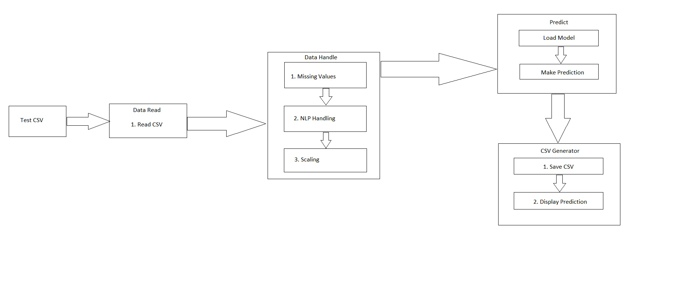

# Real or Fake job detection
This project is based on the dataset from [Fake job prediction kaggle dataset](https://www.kaggle.com/shivamb/real-or-fake-fake-jobposting-prediction). In this project I will try to predict the fake job postings. There are 18 columns like title, department, company profile, job description etc. I will be using NLP Techniques to analyse text data and predict as good as possible. Also I will utilize the pipeline concept to automate the train and test process. Once the training is complete the model will be saved as a pickle file to load whenever we need to predict.

There are 17880 samples in the dataset in which 17014 are real job data and 866 are fake job data. The data is biased towards real job data.
## Pipeline overview

This is a overall view of the files and functions used in both the pipelines in the project. Below I have attached both train and test pipelines separately.

## training pipeline

The training process contains 3 major steps
1. Data Reading
2. Data Handling
3. Model
First we read the data using Data Read file and then pass it to Data handling file where the missing values, Text data Handling takes place. After Handling the data and scaling then we will utilize neural nets to create and train model on the cleaned data. After training the model then we save the model as a pickle file so it can be loaded.  
## testing pipeline

Similar to training we need to read the data using Data Read file and then handle the data(missing values, Text data Handling). After Handling the data and scaling then we will make use of the saved model to test the data and save the predicted result as a csv.
## Files and Functions

## How to run and test
### Train

### Test

## libraries used
